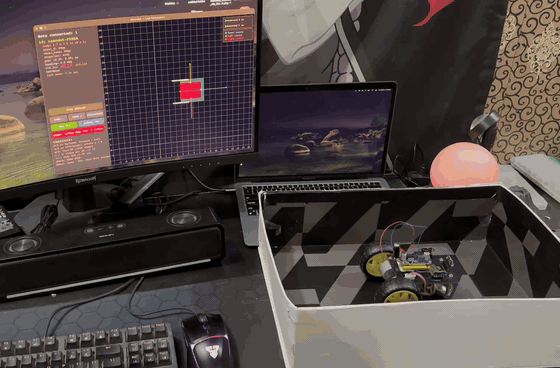
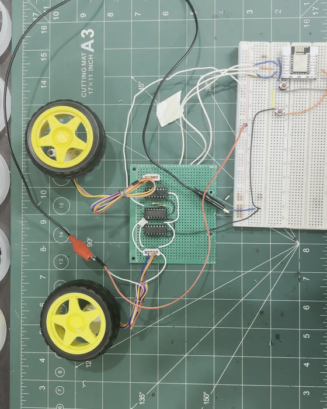
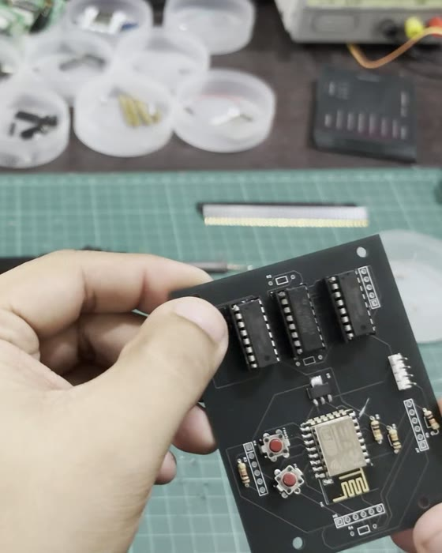
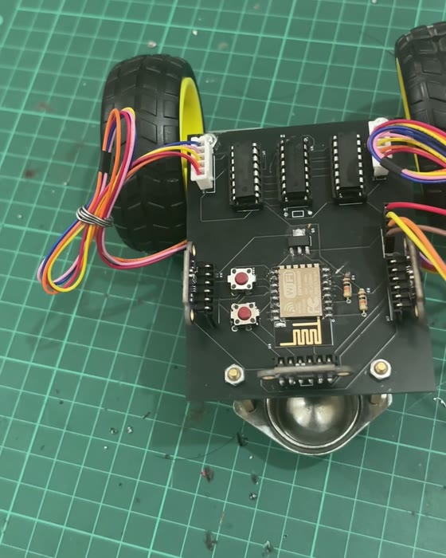
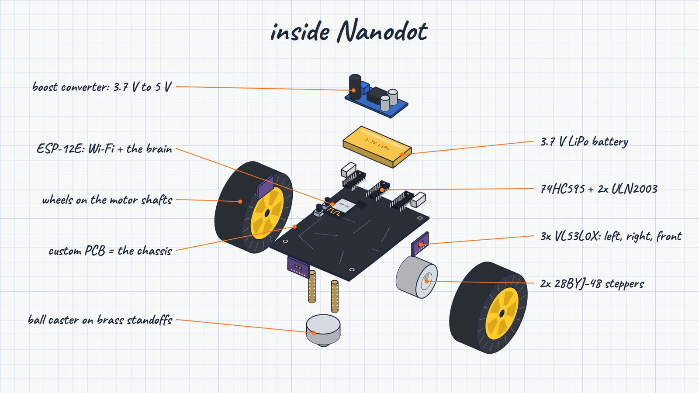
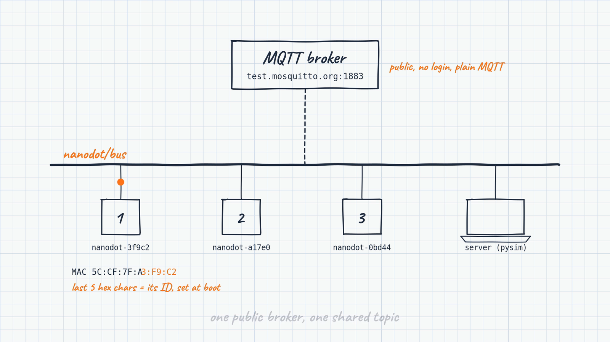

# Nanodot

A small ESP8266 robot that maps a room with three time-of-flight distance sensors and streams everything over MQTT to a live map on your computer. You can drive it from the keyboard, or switch on **AUTO EXPLORE** and let it cover as much floor as it can without touching a wall.

<p align="center">
  
</p>

The custom PCB is the chassis. An ESP-12E runs the firmware, two 28BYJ-48 steppers drive the wheels, and VL53L0X sensors look front, left and right. Every reading is sent over MQTT to the Python server, which turns the sensor hits into a map in real time.

## Build

<p align="center">
  
  
  
</p>
<p align="center"><sub>Breadboard prototype → assembled PCB → finished robot</sub></p>

## Hardware

<p align="center">
  
</p>

| Part | Qty | Role |
| --- | --- | --- |
| ESP-12E (ESP8266) | 1 | Wi-Fi + the brain |
| VL53L0X time-of-flight sensor | 3 | Distance: front, left, right |
| 74HC595 shift register | 1 | Drives both steppers from 3 GPIO pins |
| ULN2003 driver | 2 | Stepper coil drivers |
| 28BYJ-48 stepper motor | 2 | Drive wheels (half-step, 4096 steps/rev) |
| 69 mm wheel | 2 | On the motor shafts |
| 3.7 V LiPo battery | 1 | Power |
| Boost converter, 3.7 V → 5 V | 1 | Motor + logic supply |
| Ball caster + brass standoffs | 1 | Third contact point |
| Custom PCB | 1 | The chassis (design files in [`easyeda/`](easyeda/)) |

<details>
<summary>Pin map</summary>

| Function | GPIO |
| --- | --- |
| 74HC595 SER / SRCLK / RCLK | 14 / 13 / 12 |
| I2C SDA / SCL | 4 / 5 |
| VL53L0X XSHUT front / right / left | 2 / 16 / 15 |
| Wi-Fi status LED (onboard, shared with XSHUT front) | 2 |
| ACK LED | 0 |

The three sensors share one I2C bus. At boot, the firmware brings them up one at a time with XSHUT and gives each its own address (`0x30` front, `0x32` right, `0x31` left).
</details>

## How it works

<p align="center">
  
</p>

Every bot and the server publish to one shared topic, `nanodot/bus`, on the public broker `test.mosquitto.org:1883`. Each bot names itself `nanodot-` plus the last 5 hex characters of its MAC address. It ignores its own echoes and any message not addressed to it or to `all`.

Every message has the same envelope:

```json
{ "sender": "nanodot-3f9c2", "receiver": "server", "type": "ping", "ts": 123456, "data": { } }
```

| Type | Direction | When | `data` |
| --- | --- | --- | --- |
| `handshake` | bot → server | On connect | `wheel_diameter_mm`, `wheel_base_mm`, `steps_per_rev`, `burst_steps` |
| `ping` | bot → server | Every 250 ms while idle | `x`, `y`, `theta`, `f`, `r`, `l`, `bat` |
| `motion` | bot → server | After every burst of steps during a move | `cmd`, `dir`, `x`, `y`, `theta`, `f`, `r`, `l`, `bat` |
| `cmd` | server → bot | To drive it | `cmd` + `steps` (see below) |

`x` and `y` are odometry in mm, `theta` is in radians, and `f`/`r`/`l` are sensor readings in mm (8190 or more means out of range).

| `cmd` | Action |
| --- | --- |
| `F` / `B` + `steps` | Forward / backward |
| `L` / `R` + `steps` | Rotate left / right in place |
| `Q` / `E` | Turn 90° left / right |
| `S` | Hard stop: cuts the coils and clears any queued command |

A command that arrives while the bot is already moving is queued (one slot) and runs when the current move finishes. `S` always runs immediately.

The server turns each reading into dots on the map. When a new beam passes through old dots, it wipes them, so the map stays current when things move. AUTO EXPLORE plans over a 1-inch grid. It only takes moves whose whole footprint stays clear of the walls it has seen, and it shades covered floor in teal.

## Getting started

### 1. Flash the firmware

1. In the Arduino IDE, install the **esp8266** board package, then these libraries from the Library Manager:
   - WiFiManager (tzapu)
   - PubSubClient (Nick O'Leary)
   - ArduinoJson (v6+)
   - VL53L0X (Pololu)
2. Open [`esp_firmware/esp_firmware.ino`](esp_firmware/esp_firmware.ino) and select **Generic ESP8266 Module** as the board.
3. Connect a USB-serial adapter. Hold **PROG**, tap **RESET**, then upload.

On first boot the bot opens a Wi-Fi access point called **`Nanodot-Setup`**. Join it from your phone, pick your network and enter its password. The bot saves the network and connects on its own from then on. The onboard LED blinks while it connects.

Serial monitor at 115200 baud: you can also type commands such as `F490`, `L1499`, `Q` or `S` there for testing.

### 2. Run the server

```bash
cd server
python3 -m venv .venv
source .venv/bin/activate
pip install -r requirements.txt
python main.py
```

Power on the bot. It appears in the side panel as soon as its first message arrives.

| Key / button | Action |
| --- | --- |
| `W` `A` `S` `D` / arrows | Forward, rotate left, back, rotate right |
| `Q` / `E` | Turn 90° left / right |
| `+` / `-` | Change the step size for moves |
| `[` / `]` | Tune steps per 90° live (until 4 × `Q` is exactly 360°) |
| `Space` | Hard stop |
| **AUTO EXPLORE** | Self-driving on/off. Any driving key takes back control. |
| **RESET** | Clear the map. The bot's current spot becomes the start. |
| **ROTATE 360** | One full turn, to scan the surroundings |
| **HIDE BOX** | Hide the green calibration box and its per-sensor error stats |
| Mouse wheel / **ZOOM** | Zoom |
| **FULLSCREEN** / `Esc` | Enter / leave full screen |

> **Note:** `test.mosquitto.org` is a public broker with no login, so anyone subscribed to `nanodot/bus` can see your bot's messages and send it commands. For anything beyond experimenting, change `MQTT_BROKER` in both `esp_firmware.ino` and `server/main.py` to your own broker.

## Repository layout

```
esp_firmware/   Arduino sketch for the ESP-12E
server/         Live map + control app (Python, pygame, paho-mqtt)
easyeda/        PCB schematic, layout and fabrication files
images/         Pictures used in this README
```

## Roadmap

Nanodot started as a plan for a swarm: drop several bots anywhere in a space and have them map it together.

- [x] One bot mapping a space live over MQTT
- [x] Unique IDs from the MAC address, plus a handshake on connect
- [x] Self-driving exploration that avoids walls (AUTO EXPLORE)
- [ ] Several bots at once, with the server merging their maps into one
- [ ] New bots spread out automatically to unexplored areas
- [ ] Message acknowledgements and retry
- [ ] Battery reporting (the `bat` field is `null` until the battery circuit is finished)
